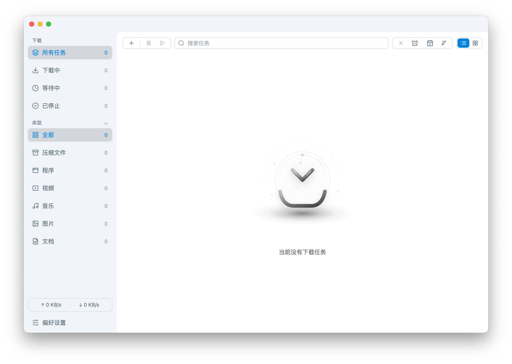

<div align="center">
  <table width="100%">
    <tr>
      <td align="right"><a href="./README.md">English</a></td>
    </tr>
  </table>
</div>

<p align="center">
  
</p>

<p align="center">
  <a href="https://github.com/MochengCK/LinkCore/releases">
    
  </a>
  <a href="https://github.com/MochengCK/LinkCore/releases">
    
  </a>
  <a href="#支持平台">
    
  </a>
  <a href="https://github.com/MochengCK/LinkCore/blob/master/LICENSE">
    
  </a>
</p>

## 项目简介

基于 FluxCore 引擎的现代化下载管理器，针对 Windows、macOS 和 Linux 深度优化。支持 HTTP、FTP、BitTorrent 和磁力链接，提供专业级功能：UPnP/NAT-PMP 端口映射、Tracker 自动更新、任务优先级管理、批量操作和高级下载预设。

## 界面截图

<table>
  <tr>
    <td align="center" width="50%">
      
      <p><em>浅色模式</em></p>
    </td>
    <td align="center" width="50%">
      
      <p><em>深色模式</em></p>
    </td>
  </tr>
</table>

### 引擎版本与连接数

- 程序默认内置并使用 FluxCore 下载引擎；同时适配其他下载引擎（如 aria2c 1.36.0 / 1.37.0），应用会根据不同引擎的连接上限自动调整"单服务器最大连接数"，以保证稳定与兼容。
- 兼容示例：aria2c 1.37.0 的"单服务器最大连接数"上限为 16；aria2c 1.36.0 上限为 64。切换引擎后，应用会自动采用对应策略并保留既有分片并发设置。
- 提示：HTTP/FTP 单源下载的真实并发为 min(split, max-connection-per-server)；BT 或多镜像源下载可叠加并发，对整体速度影响较小。

## 核心功能

### 性能与可靠性

- **高速下载**：针对最大下载性能进行了优化
- **多线程支持**：每个任务最多支持 128 个线程
- **并发下载**：可同时管理多达 10 个下载任务
- **稳定连接**：强大的错误处理和自动重试机制

### 协议支持

- **HTTP/HTTPS**：直接从 Web 服务器下载
- **FTP/SFTP**：从 FTP 服务器传输文件
- **BitTorrent**：完整支持种子文件，可选择性下载
- **磁力链接**：无需 .torrent 文件即可直接下载

### 视频下载

- **在线视频下载（浏览器扩展）**：通过浏览器扩展嗅探视频资源，一键发送到应用创建下载任务（会携带必要请求头以提高可用性）
- **统一任务管理**：视频资源以普通下载任务进入任务列表，支持与其他任务一致的暂停/恢复/删除等管理体验

### 用户体验

- **简洁界面**：现代直观的设计，支持深色模式
- **系统托盘集成**：快速访问和状态监控
- **下载通知**：下载完成时实时提醒
- **速度控制**：设置上传和下载速度限制
- **文件管理**：按类别和位置组织下载文件

### 高级功能

- **Tracker 更新**：每日自动更新 Tracker 列表，提升种子下载性能
- **UPnP/NAT-PMP**：自动端口映射，提高连接性
- **User-Agent 伪装**：自定义 User-Agent 字符串，增强兼容性
- **任务调度**：设置下载时间和优先级
- **批量下载**：导入和导出下载列表

### 独特功能

- **文件分类**：根据文件类型自动分类保存
- **自定义分类**：用户可自定义文件分类规则
- **任务优先值**：用户可设置任务的优先值，影响下载顺序、下载资源分配
- **自定义下载中文件后缀**：用户可自定义下载中文件的后缀，方便文件管理
- **将文件修改日期设置为下载完成时间**：用户可选择将下载完成的文件修改日期设置为与下载完成时间相同，方便文件管理
- **快速切换下载引擎**：用户可在不同下载引擎之间快速切换，满足不同下载需求
- **高级选项预设**：支持为高级选项命名保存、选择应用、删除预设
- **链接输入体验优化**：自动去重重复链接；粘贴或自动填充后自动换行并定位光标
- **自定义快捷键**：在"偏好设置 -> 基础设置 -> 快捷键"卡片中为常用命令设置或重置快捷键

## 支持平台

LinkCore 目前支持以下平台：

- **Windows** (7, 8, 10, 11)
- **macOS**（Intel，x64；Apple Silicon，arm64）
- **Linux** (x64, arm64)

## 安装方式

### Windows

1. 访问 [GitHub Releases](https://github.com/MochengCK/LinkCore/releases) 页面
2. 下载最新版本的 `LinkCore-Setup-x.y.z.exe` 安装程序
3. 运行安装程序并按照屏幕提示完成安装

### macOS

1. 访问 [GitHub Releases](https://github.com/MochengCK/LinkCore/releases) 页面
2. 下载 `*.dmg`（x64/arm64）或 `*-mac.zip` / `*-arm64-mac.zip`（x64/arm64）
3. 使用 `*.dmg`：双击打开，将应用拖拽到 `/Applications`
4. 使用 `*.zip`：解压后将应用移动到 `/Applications`
5. 首次运行若提示"无法验证开发者"，请在"系统设置 -> 隐私与安全"中点击"仍要打开"，或在 Finder 中对应用图标"右键 -> 打开"

### Linux

- AppImage（通用推荐）：
  1. 下载 `*.AppImage`（`x64` 或 `arm64`）
  2. 赋予可执行权限：`chmod +x LinkCore-*.AppImage`
  3. 运行：`./LinkCore-*.AppImage`

- Debian/Ubuntu（`.deb` 包）：
  1. 下载 `linkcore_*_amd64.deb` 或 `linkcore_*_arm64.deb`
  2. 安装：`sudo dpkg -i linkcore_*.deb`
  3. 如有依赖问题：`sudo apt -f install`

- 其他发行版：优先使用 AppImage 方式。

## 开发指南

### 前置要求

- Node.js (v16.0.0 或更高版本)
- npm 或 yarn
- Git

### 设置开发环境

1. 克隆仓库：
   ```bash
   git clone https://github.com/MochengCK/LinkCore.git
   cd LinkCore
   ```

2. 安装依赖：
   ```bash
   npm install
   ```

3. 启动开发服务器：
   ```bash
   npm run dev
   ```

4. 构建生产版本：
   ```bash
   npm run build
   ```

### 项目结构

```
LinkCore/
├── src/                  # 主要源代码
│   ├── main/             # Electron 主进程
│   ├── renderer/         # Electron 渲染进程（Vue.js）
│   └── shared/           # 共享工具
├── static/               # 静态资源
├── .electron-vue/        # Electron-Vue 配置
├── screenshots/          # 文档截图
├── package.json          # 项目配置
└── README.md             # 项目文档
```

## 参与贡献

欢迎贡献代码！无论您是修复 Bug、添加新功能还是改进文档，我们都非常感谢您的帮助。

### 如何贡献

1. Fork 本仓库
2. 创建新分支 (`git checkout -b feature/your-feature`)
3. 进行修改
4. 提交更改 (`git commit -m 'Add some feature'`)
5. 推送到分支 (`git push origin feature/your-feature`)
6. 创建 Pull Request

### 开发指南

- 遵循现有代码风格
- 编写清晰简洁的提交信息
- 为新功能添加测试
- 按需更新文档

## 致谢

- 本项目基于 agalwood 开源项目 [Motrix](https://github.com/agalwood/Motrix) 开发，并在其基础上进行了大量修改和功能扩展
- UI 框架：[Vue.js](https://vuejs.org/)
- 桌面框架：[Electron](https://www.electronjs.org/)
- 视频处理：[FFmpeg](https://ffmpeg.org/)
- 下载引擎：[FluxCore](https://github.com/MochengCK/FluxCore)

## 支持

如果您遇到任何问题或有疑问：

- 在 GitHub 上 [提交 issue](https://github.com/MochengCK/LinkCore/issues/new/choose)
- 加入我们的社区进行讨论和获取支持

## 许可证

本项目基于 [MIT License](LICENSE) 开源。