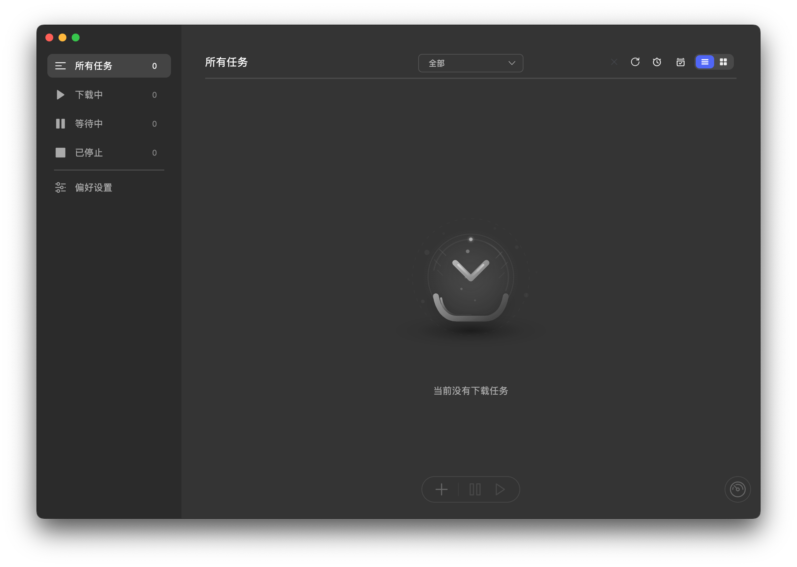

<div align="center">
  <table width="100%">
    <tr>
      <td align="right"><a href="./README-CN.md">简体中文</a></td>
    </tr>
  </table>
</div>

<p align="center">
  
</p>

<p align="center">
  <a href="https://github.com/MochengCK/LinkCore-Download-Manager/releases">
    
  </a>
  <a href="https://github.com/MochengCK/LinkCore-Download-Manager/releases">
    
  </a>
  <a href="#platforms">
    
  </a>
  <a href="https://github.com/MochengCK/LinkCore-Download-Manager/blob/master/LICENSE">
    
  </a>
</p>


## 📖 Overview

LinkCore Download Manager is a [simple], [beautiful], and [easy-to-use] cross-platform download manager built with modern web technologies. With an out-of-the-box intuitive interface, clear task flow, and minimal necessary settings, it makes download management simpler. It supports common download protocols and online video downloads, or video sniffing with extensions, covering everyday usage scenarios.
***
At the same time, LinkCore Download Manager also possesses professional-grade downloader capabilities: supporting BitTorrent/Magnet, UPnP/NAT-PMP port mapping, automatic Tracker updates, task priority and batch management, quick switching of download engines, and advanced option presets, satisfying advanced and heavy download scenarios.

## ✨ Key Features

### 🚀 Performance & Reliability
- **High-Speed Download**: Optimized for maximum download performance
- **Multi-threading Support**: Each task supports up to 64 threads
- **Concurrent Downloads**: Can manage up to 10 download tasks simultaneously
- **Stable Connection**: Robust error handling and automatic retry mechanism

### 📁 Protocol Support
- **HTTP/HTTPS**: Download directly from web servers
- **FTP/SFTP**: Transfer files from FTP servers
- **BitTorrent**: Full support for torrent files, with selective downloading
- **Magnet Links**: Direct download without .torrent files

### 🎬 Video Download
- **Online Video Download**: Download online videos by adding video tasks within the app or using browser extensions for video sniffing
- **Multi-task Video Batch Management**: Unified viewing, pausing/resuming, and deleting video download tasks in the task list, supporting a consistent management experience with other types of tasks

### 🎨 User Experience
- **Simple Interface**: Modern intuitive design, supporting dark mode
- **System Tray Integration**: Quick access and status monitoring
- **Download Notifications**: Real-time reminders when downloads are completed
- **Speed Control**: Set upload and download speed limits
- **File Management**: Organize downloaded files by category and location

### 🔧 Advanced Features
- **Tracker Update**: Automatically update Tracker list daily to improve torrent download performance
- **UPnP/NAT-PMP**: Automatic port mapping to improve connectivity
- **User-Agent Spoofing**: Customize User-Agent strings to enhance compatibility
- **Task Scheduling**: Set download time and priority
- **Batch Download**: Import and export download lists

### 🧩 Unique Features
- **File Categorization**: Automatically classify and save according to file type
- **Custom Categorization**: Users can customize file categorization rules
- **Task Priority**: Users can set task priority values, affecting download order and resource allocation
- **Custom Downloading Suffix**: Users can customize the suffix of files being downloaded for easier file management
- **Set File Modification Date to Completion Time**: Users can choose to set the modification date of completed files to be the same as the completion time for easier file management
- **Quick Engine Switching**: Users can quickly switch between different download engines to meet different download needs
- **Advanced Option Presets**: Support for naming, saving, selecting, and deleting presets for "Advanced Options"
- **Link Input UX Optimization**: Automatically deduplicate duplicate links; automatically wrap and position cursor after pasting or auto-filling
- **Custom Shortcuts**: Set or reset shortcuts for common commands in the "Preferences → Basic Settings → Shortcuts" card


## 🖥️ Supported Platforms

LinkCore Download Manager currently supports the following platforms:
- **Windows** (7, 8, 10, 11)
- **macOS** (Intel, x64; Apple Silicon, arm64)
- **Linux** (x64, arm64)

## 📦 Installation

### Windows

1. Visit the [GitHub Releases](https://github.com/MochengCK/LinkCore-Download-Manager/releases) page
2. Download the latest version of the `LinkCore-Download-Manager-Setup-x.y.z.exe` installer
3. Run the installer and follow the on-screen prompts to complete the installation

### macOS

1. Visit the [GitHub Releases](https://github.com/MochengCK/LinkCore-Download-Manager/releases) page
2. Download `*.dmg` (x64/arm64) or `*-mac.zip` / `*-arm64-mac.zip` (x64/arm64)
3. Using `*.dmg`: Double-click to open, drag the app to `/Applications`
4. Using `*.zip`: After unzipping, move the app to `/Applications`
5. If it prompts "unidentified developer" on first run, click "Open Anyway" in "System Settings → Privacy & Security", or "Right-click → Open" on the app icon in Finder

### Linux

- AppImage (Universally Recommended):
  1. Download `*.AppImage` (`x64` or `arm64`)
  2. Grant executable permission: `chmod +x LinkCore-Download-Manager-*.AppImage`
  3. Run: `./LinkCore-Download-Manager-*.AppImage`

- Debian/Ubuntu (`.deb` package):
  1. Download `linkcore-download-manager_*_amd64.deb` or `linkcore-download-manager_*_arm64.deb`
  2. Install: `sudo dpkg -i linkcore-download-manager_*.deb`
  3. If there are dependency issues: `sudo apt -f install`

- Other distributions: Prefer the AppImage method.

## 🖥️ Screenshots

<table>
  <tr>
    <td align="center" width="50%">
      
      <p><em>Dark Mode</em></p>
    </td>
    <td align="center" width="50%">
      
      <p><em>Light Mode</em></p>
    </td>
  </tr>
</table>

### Engine Version & Connections

- The program builds in and uses `aria2c 1.37.0` by default. This version does not support setting "Max connections per server" to 64 (it will cause tasks to fail to download), so the app automatically compensates by limiting this value to 16 under this version, while maintaining `split=64` chunk concurrency.
- If you need to run with "Max connections per server" at 64, you can quickly switch to `aria2c 1.36.0` in the "Preferences → Advanced → Engine" card. After switching, `max-connection-per-server=64` will be allowed, while retaining `split=64`.
- Tip: The real concurrency for HTTP/FTP single-source download is `min(split, max-connection-per-server)`; BT or multi-mirror downloads can stack concurrency, having less impact on overall speed.

## 🛠️ Development Guide

### Prerequisites

- Node.js (v16.0.0 or higher)
- npm or yarn
- Git

### Setting up the Development Environment

1. Clone the repository:
   ```bash
   git clone https://github.com/MochengCK/LinkCore-Download-Manager.git
   cd LinkCore-Download-Manager
   ```

2. Install dependencies:
   ```bash
   npm install
   # or
   yarn install
   ```

3. Start development server:
   ```bash
   npm run dev
   ```

4. Build production version:
   ```bash
   npm run build
   ```

### Project Structure

```
LinkCore-Download-Manager/
├── src/                  # Main source code
│   ├── main/             # Electron main process
│   ├── renderer/         # Electron renderer process (Vue.js)
│   └── shared/           # Shared utilities
├── static/               # Static assets
├── .electron-vue/        # Electron-Vue configuration
├── screenshots/          # Documentation screenshots
├── package.json          # Project configuration
└── README.md             # Project documentation
```

## 🤝 Contributing

Contributions are welcome! Whether you are fixing bugs, adding new features, or improving documentation, we greatly appreciate your help.

### How to Contribute

1. Fork this repository
2. Create a new branch (`git checkout -b feature/your-feature`)
3. Make modifications
4. Commit changes (`git commit -m 'Add some feature'`)
5. Push to the branch (`git push origin feature/your-feature`)
6. Create a Pull Request

### Development Guidelines

- Follow existing code styles
- Write clear and concise commit messages
- Add tests for new features
- Update documentation as needed

## 💰 Sponsor

If you find this project helpful, please consider sponsoring to support the continuous development and maintenance of the project.

- [Sponsor on Afdian](https://afdian.com/a/LinkCore)

## 🙏 Credits

- This project is developed based on the open-source project [Motrix](https://github.com/agalwood/Motrix) by agalwood, with significant modifications and functional extensions.
- UI Framework: [Vue.js](https://vuejs.org/)
- Desktop Framework: [Electron](https://www.electronjs.org/)
- Video Processing: [FFmpeg](https://ffmpeg.org/)
- Download Engine: [aria2](https://aria2.github.io/)

## 📞 Support

If you encounter any problems or have questions:

- [Submit an issue](https://github.com/MochengCK/LinkCore-Download-Manager/issues/new/choose) on GitHub
- Join our community for discussion and support

## 📄 License

This project is open-sourced under the GNU General Public License v3.0 [(GPL-3.0)](LICENSE)
