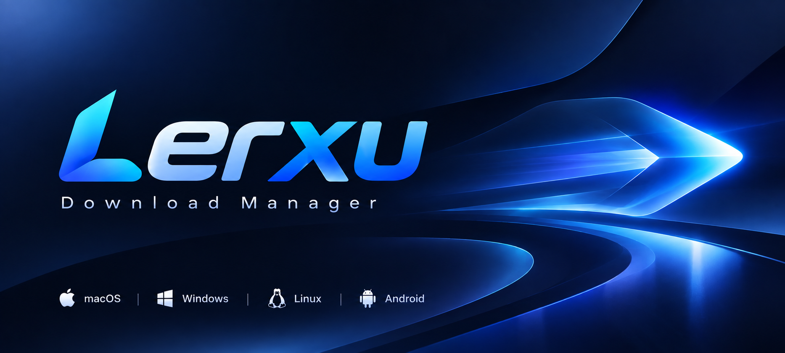
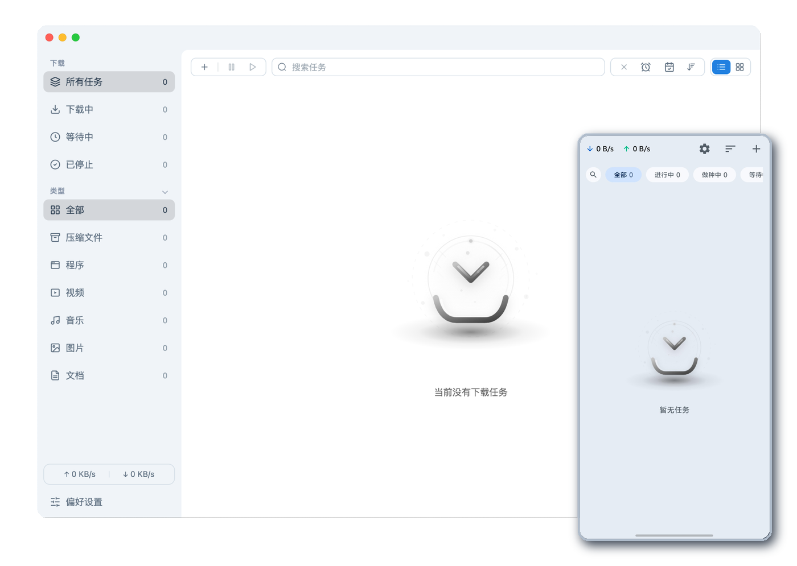
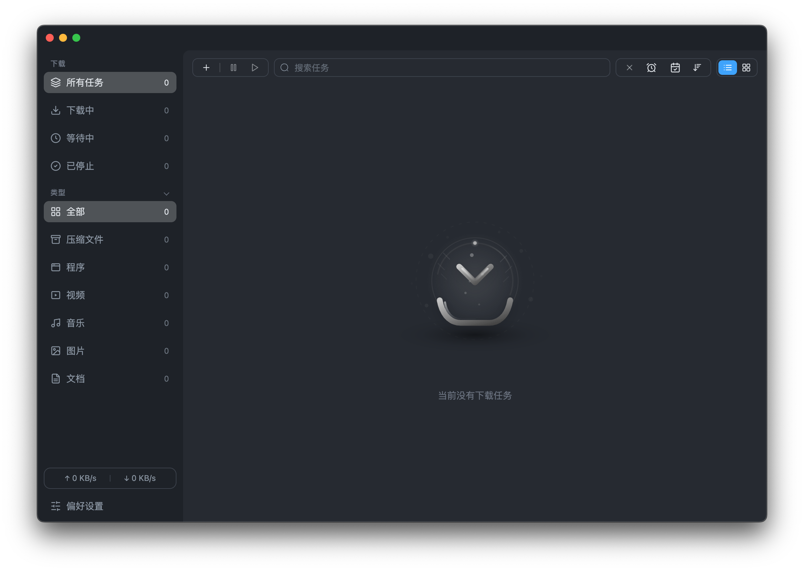

<div align="center">
  <table width="100%">
    <tr>
      <td align="right"><a href="./README-CN.md">中文</a></td>
    </tr>
  </table>
</div>

<p align="center">
  
</p>

<p align="center">
  <a href="https://github.com/MochengCK/Lerxu/releases">
    
  </a>
  <a href="https://github.com/MochengCK/Lerxu/releases">
    
  </a>
  <a href="#supported-platforms">
    
  </a>
  <a href="https://github.com/MochengCK/Lerxu/blob/master/LICENSE">
    
  </a>
</p>

## Introduction

A modern download manager powered by the XferCore engine, optimized for Windows, macOS, and Linux. Supports HTTP, FTP, BitTorrent, Magnet links, and ED2K (eDonkey) links with professional-grade features including multi-method ED2K source discovery, automatic port mapping, automatic tracker server updates, task prioritization, batch management, and advanced download presets.

## Screenshots

<table>
  <tr>
    <td align="center" width="50%">
      
      <p><em>Light Mode</em></p>
    </td>
    <td align="center" width="50%">
      
      <p><em>Dark Mode</em></p>
    </td>
  </tr>
</table>

## Engine & Connections

- Lerxu ships with the XferCore download engine, which automatically picks the best "Max Connections per Server" setting for stable and compatible downloads.
- Each task supports up to 128 concurrent segments (32 connections per server by default), backed by a built-in disk cache for smoother parallel downloads.
- Note: Real concurrency for single-source downloads depends on the segment count; torrent and multi-mirror downloads can stack concurrency for faster overall speed.

## Core Features

### Performance & Reliability
- **High-speed Downloads**: Optimized for maximum download performance, with a built-in disk cache and connection reuse for smoother multi-task downloads
- **Multi-threaded Support**: Up to 128 threads per task
- **Concurrent Downloads**: Manage up to 10 download tasks simultaneously
- **Stable Connections**: Robust error handling and automatic retry mechanism
- **Memory Optimization**: Automatically releases memory when all windows are hidden or minimized

### Protocol Support
- **HTTP/HTTPS**: Download directly from websites, with multi-connection acceleration
- **FTP/SFTP**: Transfer files from FTP servers
- **BitTorrent**: Full torrent file support with selective downloading; built-in tracker servers for out-of-the-box use
- **Magnet Links**: Direct downloads without .torrent files
- **ED2K (eDonkey)**: Native support for eDonkey links, discovering sources via eDonkey servers, source exchange, and the KAD network

### ED2K Downloads
- **Multi-method Source Discovery**: Find sources in parallel via eDonkey servers, source exchange (server-independent), and the KAD network (experimental)
- **Server Subscription**: Subscribe to server list files, with manual sync or automatic sync on a configurable schedule; 9 popular eDonkey servers are built in
- **Configurable Parameters**: Listen port (default 4662), max connections, connection timeout, and max sources per file
- **ED2K Task Details**: View file info and a live source list in task details, including per-source status, queue position, and available pieces

### BitTorrent / Magnet Links
- **Transport Protocols**: Supports multiple transport protocols for more stable and faster downloads
- **Network Discovery**: Automatically opens network ports to improve connection success
- **Built-in Tracker Servers**: Pre-configured tracker servers so downloads work out of the box
- **Multiple Built-in Nodes**: Multiple built-in network nodes for more reliable connections
- **Auto Cleanup**: Automatically cleans up long-unresponsive connections to keep downloads efficient

### Video Download
- **Online Video Download (Browser Extension)**: Recognize web videos via the browser extension and send them to the app with one click to create download tasks
- **Download Takeover**: Clicks on download links on web pages (e.g., links with a download attribute or common file extensions) can be handed over to Lerxu, with support for excluding specific sites or file types and Alt+Click to bypass
- **Video Recognition**: Supports multiple video formats and automatically distinguishes audio streams from video streams
- **Unified Task Management**: Video resources appear as regular download tasks in the task list, supporting the same pause/resume/delete management experience as other tasks
- **Merge Progress Display**: Audio/video that needs merging enters a "merging" state with visible progress after download, and correctly merges when multiple segmented videos are sent at once

### User Experience
- **Clean Interface**: Modern, intuitive design with dark mode support
- **System Tray Integration**: Quick access and status monitoring
- **Download Notifications**: Real-time alerts when downloads complete
- **Speed Control**: Set upload and download speed limits
- **File Management**: Organize downloaded files by category and location

### Advanced Features
- **Tracker Server Updates**: Daily automatic tracker server list updates for improved torrent performance
- **Automatic Port Mapping**: Automatically opens network ports for better connectivity
- **Custom Download Identity**: Customize the download request identity for enhanced compatibility
- **Task Scheduling**: Set download times and priorities
- **Batch Downloads**: Import and export download lists
- **Update Channels**: Choose between stable, preview (beta), or latest release channels, with automatic installation after the update package downloads

### Unique Features
- **File Categorization**: Auto-sort files by type
- **Custom Categories**: User-defined file categorization rules
- **Task Priority**: Set task priority values to influence download order and resource allocation
- **Custom Download File Extension**: Customize the file extension for in-progress downloads
- **Set File Modification Date to Completion Time**: Optionally set downloaded file modification dates to match completion time
- **eDonkey Server Auto-update**: Periodically updates the eDonkey server list for smoother source discovery
- **Advanced Option Presets**: Name, save, apply, and delete presets for advanced options
- **Link Input Optimization**: Auto-deduplicate links; auto-newline and cursor positioning after paste or autofill
- **Custom Shortcuts**: Set or reset shortcuts for common commands in the "Preferences > Basic > Shortcuts" card

## Supported Platforms

Lerxu currently supports the following platforms:
- **Windows** (10, 11)
- **macOS** (Intel, x64; Apple Silicon, arm64)
- **Linux** (x64, arm64)

## Installation

### Windows

1. Visit the [GitHub Releases](https://github.com/MochengCK/Lerxu/releases) page
2. Download the latest `Lerxu-Setup-x.y.z.exe` installer
3. Run the installer and follow the on-screen instructions

### macOS

1. Visit the [GitHub Releases](https://github.com/MochengCK/Lerxu/releases) page
2. Download `*.dmg` (x64/arm64) or `*-mac.zip` / `*-arm64-mac.zip` (x64/arm64)
3. Using `*.dmg`: Double-click to open, drag the app to `/Applications`
4. Using `*.zip`: Extract and move the app to `/Applications`
5. If prompted "cannot verify developer" on first launch, go to "System Settings > Privacy & Security" and click "Open Anyway", or right-click the app icon in Finder and select "Open"

### Linux

- AppImage (Recommended):
  1. Download `*.AppImage` (`x64` or `arm64`)
  2. Grant execute permission: `chmod +x Lerxu-*.AppImage`
  3. Run: `./Lerxu-*.AppImage`

- Debian/Ubuntu (`.deb` package):
  1. Download `lerxu_*_amd64.deb` or `lerxu_*_arm64.deb`
  2. Install: `sudo dpkg -i lerxu_*.deb`
  3. If dependency issues occur: `sudo apt -f install`

- Other distributions: Use the AppImage method.

## Development Guide

### Prerequisites

- Node.js (v16.0.0 or higher)
- npm or yarn
- Git

### Setup

1. Clone the repository:
   ```bash
   git clone https://github.com/MochengCK/Lerxu.git
   cd Lerxu
   ```

2. Install dependencies:
   ```bash
   npm install
   ```

3. Start the development server:
   ```bash
   npm run dev
   ```

4. Build for production:
   ```bash
   npm run build
   ```

### Project Structure

```
Lerxu/
├── src/                  # Main source code
│   ├── main/             # Electron main process
│   ├── renderer/         # Electron renderer process (Vue.js)
│   └── shared/           # Shared utilities
├── static/               # Static assets
├── .electron-vue/        # Electron-Vue configuration
├── screenshots/          # Documentation screenshots
├── package.json          # Project configuration
└── README.md             # Project documentation
```

## Contributing

Contributions are welcome! Whether you're fixing bugs, adding new features, or improving documentation, we appreciate your help.

### How to Contribute

1. Fork the repository
2. Create a new branch (`git checkout -b feature/your-feature`)
3. Make your changes
4. Commit your changes (`git commit -m 'Add some feature'`)
5. Push to the branch (`git push origin feature/your-feature`)
6. Create a Pull Request

### Guidelines

- Follow the existing code style
- Write clear and concise commit messages
- Add tests for new features
- Update documentation as needed

## Acknowledgments

- This project is based on the agalwood open-source project [Motrix](https://github.com/agalwood/Motrix), with extensive modifications and feature extensions
- UI Framework: [Vue.js](https://vuejs.org/)
- Desktop Framework: [Electron](https://www.electronjs.org/)
- Download Engine: [XferCore](https://github.com/MochengCK/XferCore) (deeply customized from [aria2](https://github.com/aria2/aria2))

## Support

If you encounter any issues or have questions:

- Submit an [issue](https://github.com/MochengCK/Lerxu/issues/new/choose) on GitHub
- Join our community for discussion and support

## License

This project is open-sourced under the [MIT License](LICENSE).
